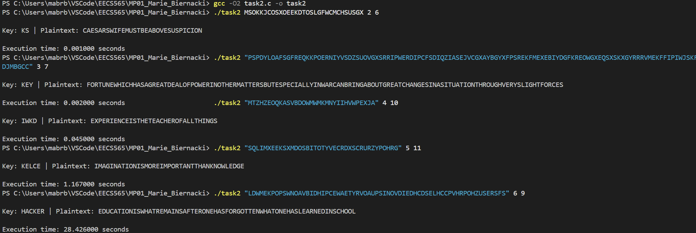

# Task 3: Performance Report

## Execution Results
Below is a summary of the brute-force execution times for 5 messages, with key lengths 2 through 6. The program was compiled using GCC with the `-O2` optimization flag.

| Key Length | Key | Plaintext | Execution Time (s) |
|---|---|---|---|
| 2 | KS | CAESARSWIFEMUSTBEABOVESUSPICION... | 0.001000 |
| 3 | KEY | FORTUNEWHICHHASAGREATDEALOFPOWER... | 0.002000 |
| 4 | IWKD | EXPERIENCEISTHETEACHEROFALLTHINGS | 0.045000 |
| 5 | KELCE | IMAGINATIONISMOREIMPORTANTTHANKNOWLEDGE | 1.167000 |
| 6 | HACKER | EDUCATIONISWHATREMAINSAFTERONEHASFORGOTTEN... | 28.426000 |

## Terminal Output Screenshot

## 1: Efficiency of Password Cracking
The efficiency of password cracking is correlated to the size of the search space. The time complexity of a brute-force Vigenere attack is $O(26^N)$, with 26 representing the alphabet size and N representing the key length. In the execution results above, a 4 character key required checking $26^4$ combinations, taking 0.045 seconds. A 6 character key required checking $26^6$ combinations, taking 28.4 seconds. This shows that brute-force is inefficient and unscalable because each additional character multiplies the computation time by 26.

## 2: Optimization Techniques
For task2.c, I attempted manual optimization. Specifically, I experimented replacing the `%` with an `if` statement and subtraction. However, when I compiled with these changes, the execution time was actually slower. I realized this happened because the CPU created an additional branch to predict the outcome of the if-statement, which ends up taking more time. Despite my optimization method not working, I have a better understanding of the CPU and the GCC compiler.
